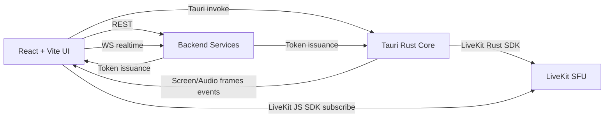

# Astrolune Desktop

Astrolune desktop client for Windows 10/11 x64 built with Tauri 2, React, and Rust.

**Architecture**

**Feature Status**
| Category | Feature | Status |
| --- | --- | --- |
| Infrastructure | Tauri 2 + Vite + React baseline | ? |
| Infrastructure | Token storage via keyring | ? |
| Infrastructure | Windows CI pipeline | ? |
| Video/Audio | LiveKit Rust publishing (mic/cam/screen) | ? |
| Video/Audio | LiveKit JS subscribing in React | ? |
| Video/Audio | 4K/60 publish presets (custom VideoEncoding) | ?? |
| Screen Capture | Windows Graphics Capture (windows-capture) | ? |
| Screen Capture | Frame events to TS (Tauri events) | ? |
| UI/UX | Call UI + device selection | ? |
| UI/UX | LiveKit Components React UI | ? |
| Backend | Typed REST clients (auth/user/guild/message/media) | ? |
| Backend | LiveKit REST client (tokens/rooms/participants) | ? |
| Backend | LiveKit realtime WS events (join/leave/mute/chat) | ? |

**Getting Started**
1. Install Node.js 20+ and Rust stable.
2. Install dependencies: `npm ci`.
3. Start the desktop app: `npm run tauri dev`.

**Environment Variables**
| Name | Purpose | Default |
| --- | --- | --- |
| `VITE_AUTH_API_URL` | Auth service base URL | `http://localhost:5001/api/auth` |
| `VITE_USER_API_URL` | User service base URL | `http://localhost:5002/api/users` |
| `VITE_GUILD_API_URL` | Guild service base URL | `http://localhost:5003/api/guilds` |
| `VITE_MESSAGE_API_URL` | Message service base URL | `http://localhost:5004/api/messages` |
| `VITE_MEDIA_API_URL` | Media service base URL | `http://localhost:5005/api` |
| `VITE_REALTIME_API_URL` | Realtime service base URL | `http://localhost:6000` |
| `VITE_REALTIME_WS_URL` | Realtime WS override | `http://localhost:6000/ws` |
| `VITE_LIVEKIT_API_URL` | LiveKit backend API base URL | `http://localhost:5005/api/livekit` |
| `VITE_LIVEKIT_WS_URL` | LiveKit backend WS base URL | `ws://localhost:5005/ws/livekit` |

**Roadmap**
1. Wire LiveKit Components React for production-ready call UI.
2. Add GPU-aware presets and adaptive bitrate hints for 4K/60 streams.
3. Expand realtime event handling for moderation and analytics.
4. Add diagnostics overlay for capture and publish pipelines.

**Build Artifacts**
- `src-tauri/target/release/bundle/msi`
- `src-tauri/target/release/bundle/nsis`

**CI**
GitHub Actions workflow: `.github/workflows/windows-ci.yml`.
It runs `npm run build`, `cargo check` in `src-tauri`, and `npm run tauri build`.
